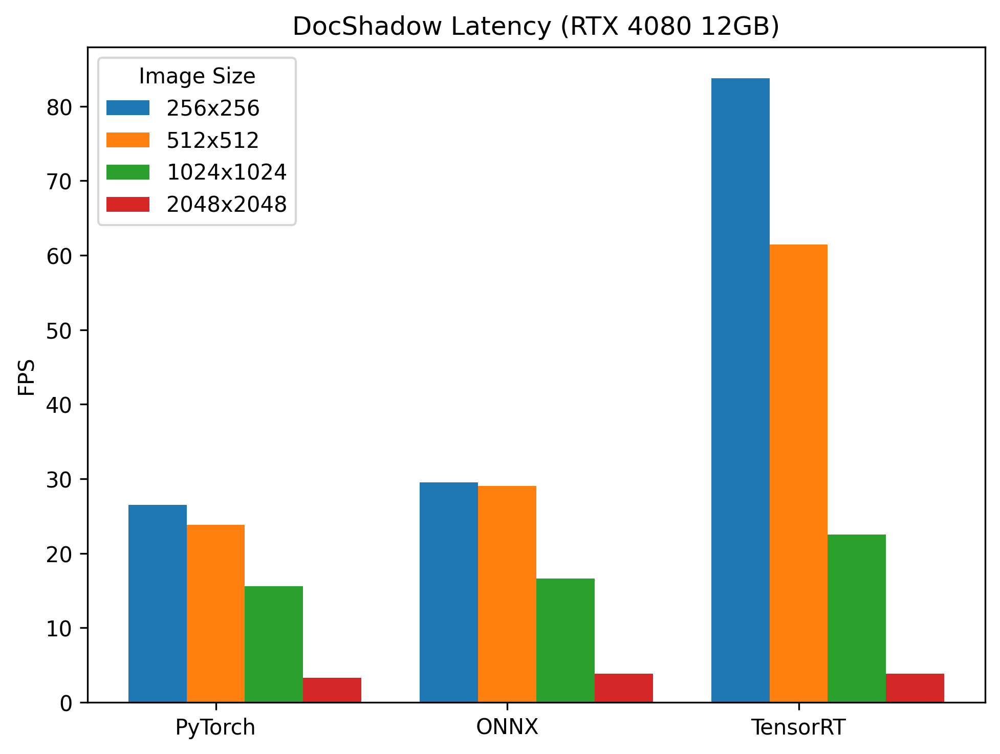

[](/LICENSE)
[](https://onnx.ai/)
[](https://developer.nvidia.com/tensorrt)
[](https://github.com/fabio-sim/DocShadow-ONNX-TensorRT/stargazers)
[](https://github.com/fabio-sim/DocShadow-ONNX-TensorRT/releases)

# DocShadow-ONNX-TensorRT
Open Neural Network Exchange (ONNX) compatible implementation of [DocShadow: High-Resolution Document Shadow Removal via A Large-scale Real-world Dataset and A Frequency-aware Shadow Erasing Net](https://github.com/CXH-Research/DocShadow-SD7K). Supports TensorRT 🚀.

<p align="center"><br><em>DocShadow ONNX TensorRT provides up to a 2x speedup over PyTorch.</em></p>

## 🔥 ONNX Export

Prior to exporting the ONNX models, please install the [requirements](/requirements.txt).

To convert the DocShadow models to ONNX, run [`export.py`](/export.py).

<details>
<summary>Export Example</summary>
<pre>
python export.py \
    --weights sd7k \
    --dynamic_img_size --dynamic_batch
</pre>
</details>

If you would like to try out inference right away, you can download ONNX models that have already been exported [here](https://github.com/fabio-sim/DocShadow-ONNX-TensorRT/releases) or run `./weights/download.sh`.

## ⚡ ONNX Inference

With ONNX models in hand, one can perform inference on Python using ONNX Runtime (see [requirements-onnx.txt](/requirements-onnx.txt)).

The DocShadow inference pipeline has been encapsulated into a runner class:

```python
from onnx_runner import DocShadowRunner

images = DocShadowRunner.preprocess(image_array)
# images.shape == (B, 3, H, W)

# Create ONNXRuntime runner
runner = DocShadowRunner(
    onnx_path="weights/docshadow_sd7k.onnx",
    providers=["CUDAExecutionProvider", "CPUExecutionProvider"],
    # TensorrtExecutionProvider
)

# Run inference
result = runner.run(images)
```
Alternatively, you can also run [`infer.py`](/infer.py).

<details>
<summary>Inference Example</summary>
<pre>
python infer.py \
    --img_path assets/sample.jpg \
    --img_size 256 256 \
    --onnx_path weights/docshadow_sd7k.onnx \
    --viz
</pre>
</details>

## 🚀 TensorRT Support

TensorRT offers the best performance and greatest memory efficiency.

TensorRT inference is supported for the DocShadow model via the TensorRT Execution Provider in ONNXRuntime. Please follow the [official documentation](https://docs.nvidia.com/deeplearning/tensorrt/install-guide/index.html) to install TensorRT.

<details>
<summary>TensorRT Example</summary>
<pre>
CUDA_MODULE_LOADING=LAZY && python infer.py \
  --img_path assets/sample.jpg \
  --onnx_path weights/docshadow_sd7k.onnx \
  --img_size 256 256 \
  --trt \
  --viz
</pre>
</details>

The first run will take longer because TensorRT needs to initialise the `.engine` and `.profile` files. Subsequent runs should use the cached files. Only static input shapes are supported. Note that TensorRT will rebuild the cache if it encounters a different input shape.

## Credits
If you use any ideas from the papers or code in this repo, please consider citing the authors of [DocShadow](https://arxiv.org/abs/2308.14221). Lastly, if the ONNX or TensorRT versions helped you in any way, please also consider starring this repository.

```bibtex
@article{docshadow_sd7k,
  title={High-Resolution Document Shadow Removal via A Large-Scale Real-World Dataset and A Frequency-Aware Shadow Erasing Net},
  author={Li, Zinuo and Chen, Xuhang and Pun, Chi-Man and Cun, Xiaodong},
  journal={arXiv preprint arXiv:2308.14221},
  year={2023}
}
```
